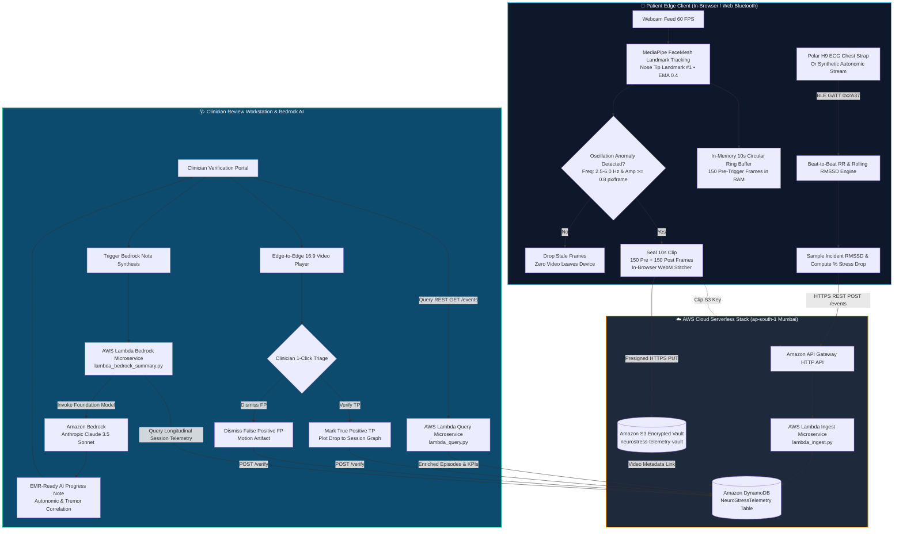

# NeuroTrial — Nystagmus & Stress Digital Biomarker Platform
### Decentralized Clinical Trial (DCT) & Remote Autonomic Telemetry Evaluation System
**Built for the Bharat Builds AWS Hackathon (Healthcare & AI Innovation Track)**

[](https://main.dfms9o6dmkyla.amplifyapp.com/)
[-blue.svg?logo=amazon-aws)](https://aws.amazon.com/)
[](https://aws.amazon.com/bedrock/)
[](https://mediapipe.dev)
[](https://www.youtube.com/watch?v=0W904keGQXI)
[](./LICENSE)

---

## 🚀 Live Deployed Application (AWS Amplify • 100% HTTPS)

| Portal / Component | Primary Live Link (AWS Amplify) | Global CDN Mirror (CloudFront) | Description |
| :--- | :--- | :--- | :--- |
| 🌐 **Platform Landing Page** | **[Launch Landing Portal](https://main.dfms9o6dmkyla.amplifyapp.com/index.html)** | [CloudFront Mirror](https://d3sigeid8sbgs9.cloudfront.net/index.html) | Architecture overview, scientific foundations & in-browser explainer video |
| 🧑‍⚕️ **Patient Telemetry Studio** | **[Launch Patient Studio](https://main.dfms9o6dmkyla.amplifyapp.com/patient.html)** | [CloudFront Mirror](https://d3sigeid8sbgs9.cloudfront.net/patient.html) | In-browser MediaPipe FaceMesh tracking, BLE Polar H9 ECG, 10s ring buffer & Stroop stress test |
| 🏥 **Clinician Verification Portal** | **[Launch Clinician Portal](https://main.dfms9o6dmkyla.amplifyapp.com/clinician.html)** | [CloudFront Mirror](https://d3sigeid8sbgs9.cloudfront.net/clinician.html) | Video triage queue, 1-click verification, 3 multi-session graphs & Bedrock AI progress notes |
| ⚡ **AWS API Gateway REST API** | `https://x82idzhm6j.execute-api.ap-south-1.amazonaws.com` | — | Serverless HTTP API handling real-time telemetry ingestion, queries, and verification |
| 🎬 **Project Explainer Video** | **[Watch on YouTube](https://www.youtube.com/watch?v=0W904keGQXI)** | Embedded in Landing Page | Full walkthrough of the problem, edge vision buffer, and AWS serverless architecture |

---

## 🌟 Why NeuroTrial Was Made & What It Aims To Do

### 1. The Clinical Problem
* **Pathological Nystagmus** (congenital infantile or acquired from vestibular neuritis, multiple sclerosis, cerebellar ataxia, stroke, or traumatic brain injury) causes involuntary, rhythmic eye and compensatory head oscillations.
* Neurologists and clinical trial investigators have long observed that **acute sympathetic stress and cognitive load dramatically exacerbate oscillation severity**, degrading patient visual acuity and functional independence.
* **The Traditional Bottleneck**: Conventional clinical evaluations require patients to travel to specialized medical centers for infrequent, isolated snapshot visits. These snapshot tests:
  - Fail to capture real-world diurnal fluctuations in daily life.
  - Suffer from **"white-coat syndrome"** (artificial anxiety that elevates resting stress levels and distorts baseline measurements).
  - Lack objective, continuous quantification of the physiological relationship between autonomic stress and tremor flares.

### 2. The Remote Monitoring Dilemma
* Continuous 24/7 video streaming of a patient's face from home creates **severe HIPAA/DPDP privacy violations**, astronomical cloud storage costs, and prohibitive network bandwidth consumption ($\sim 50\text{ GB/day/patient}$).
* Raw video alone without autonomic physiological telemetry leaves doctors unable to determine whether an oscillation was caused by an acute stress surge or a harmless physical movement.

### 3. What NeuroTrial Aims To Do
**NeuroTrial** establishes the first real-time, privacy-preserving digital biomarker pipeline that links **involuntary head/eye oscillations** with **acute autonomic stress** (measured via parasympathetic vagal withdrawal / RMSSD collapse):

1. **Zero-Trust Edge Computer Vision**: Runs MediaPipe Face Mesh sub-pixel landmark tracking entirely **inside the client browser or local device**. No raw video is streamed to the cloud during normal monitoring.
2. **Event-Triggered 10-Second Rolling Circular Ring-Buffer**: Keeps the last 5.0 seconds of video volatile in local RAM. Only when an oscillation anomaly exceeds validated frequency and amplitude thresholds does the system record 5.0 seconds post-trigger footage, assemble a **10.0-second encrypted clip** ($5\text{s pre} + 5\text{s post}$), and upload it to an encrypted Amazon S3 vault.
3. **Calibrated Baseline vs. Incident RMSSD Telemetry**: Establishes a 5-minute quiet resting baseline vagal tone ($\text{RMSSD}_{\text{base}}$). During an oscillation flare, it calculates the 60-second incident window $\text{RMSSD}_{\text{incident}}$ to determine the exact **autonomic stress drop percentage**.
4. **Human-in-the-Loop Clinician Verification**: Provides neurologists with a 1-click video triage workstation to verify True Positives (TP) vs. Dismiss False Positives (FP), dynamically plotting verified data onto multi-session correlation graphs.
5. **Amazon Bedrock AI Neurological Copilot**: Employs Anthropic Claude 3.5 Sonnet on Amazon Bedrock to automatically synthesize longitudinal telemetry into EMR-ready SOAP progress notes.

```
┌────────────────────────────────────────────────────────────────────────────────────────┐
│                                   NEUROTRIAL PLATFORM                                  │
├──────────────────────────────┬────────────────────────────┬────────────────────────────┤
│   Patient Studio (Edge CV)   │ Clinician Workstation (UI) │   AWS Cloud Intelligence   │
│  - MediaPipe 60 FPS Tracking │  - Equal-Height 3-Col View │  - API Gateway + Lambda    │
│  - 10s Ring Buffer Capture   │  - Video Verification Queue│  - DynamoDB Telemetry Store│
│  - In-Browser WebM Stitcher  │  - 3 Multi-Session Graphs  │  - Amazon S3 Encrypted Clip│
│  - BLE Polar H9 HRV Engine   │  - Bedrock AI SOAP Notes   │  - Amazon Bedrock (Claude) │
└──────────────────────────────┴────────────────────────────┴────────────────────────────┘
```

---

## 🔄 End-to-End System Workflow



---

## 🚀 Key Portal Features

### 👤 1. Patient Clinical Studio (`patient.html`)
* **100% In-Browser Zero-Install**: Uses standard Web APIs (Web Bluetooth, WebCam `getUserMedia`, Canvas API).
* **MediaPipe Sub-Pixel Landmark Tracking**: Tracks Landmark `#1` (Nose Tip) with an Exponential Moving Average ($EMA = 0.4$) filter and $0.8\text{ px/frame}$ velocity sensitivity.
* **10-Second In-Memory Ring Buffer**: Retains 150 pre-trigger frames in RAM. On detection, it captures 150 post-trigger frames and stitches all 300 frames ($10.0\text{s}$ at $30\text{ fps}$) into a standalone WebM video blob locally in $<80\text{ms}$ using `webm_encoder.js`.
* **Post-Capture Cooldown**: 6-second lockout after clip packaging to prevent duplicate triggers.
* **Autonomic Telemetry**: Live heart rate (BPM), beat-to-beat RR intervals, and rolling RMSSD via Polar H9 Bluetooth chest strap (or synthetic medical fallback).
* **Guided Stress Protocol (Stroop Challenge)**: Interactive color-word conflict test designed to induce acute cognitive load and evaluate vagal withdrawal.

### 🩺 2. Clinician Video Verification Workstation (`clinician.html`)
* **Multi-Patient Cohort Switcher**: Seamlessly switch between clinical trial subjects (`patient_001`, `patient_002`, `patient_003`) with dynamic KPI cards (Total Episodes, True Positive Precision %, Episodes to Review).
* **Video Triage Queue (Column 1)**: Filterable by `All`, `Pending Review`, `Verified TP`, and `Dismissed FP`.
* **Edge-to-Edge Video Review Player (Column 2)**: 16:9 video workstation with live HUD overlay (incident RMSSD, % stress drop, oscillation frequency), $1.0\times / 0.5\times$ slow-motion playback, timeline scrubbing, and 1-click `✓ Verify TP` / `✕ Dismiss FP` actions.
* **3 Multi-Session Longitudinal Graphs (Column 3)**:
  - **`Session 1: Stroop Test`**: Active live protocol session. Any new oscillation recorded on the Patient Portal dynamically appends here upon verification.
  - **`Session 2 — Cognitive Fatigue & Stroop`**: Day 2 cognitive challenge session.
  - **`Session 3 — Visual Strain & Display Contrast`**: Day 3 high-contrast screen fatigue session.
  - **Expandable Modal (⛶)**: Full high-resolution longitudinal RMSSD drop trajectory with summary statistics.
* **AI Clinical Progress Note (Amazon Bedrock)**: Generates EMR-ready SOAP progress notes via Anthropic Claude 3.5 Sonnet.
* **Pixel-Perfect Equal Height Layout**: All 3 workstation columns maintain a strictly unified vertical baseline with internal scrolling.

### 🐍 3. Python Native Hardware Pipeline (`OscillationTracker.py`)
* Concurrent multi-threaded Python runtime:
  - **Main Thread**: OpenCV + MediaPipe face detection, sub-pixel displacement calculation, and peak-detection algorithm.
  - **Asynchronous BLE Thread**: Uses `bleak` and `asyncio` to interface directly with Polar H9 ECG hardware over Bluetooth GATT (`0x2A37`).
* Real-time CSV and video logging with thread-safe data synchronization.

---

## 📊 Autonomic Telemetry & RMSSD Mathematics

Heart Rate Variability (HRV) is the gold-standard non-invasive biomarker of Autonomic Nervous System (ANS) activity. NeuroTrial calculates **RMSSD (Root Mean Square of Successive Differences)**:

$$\text{RMSSD} = \sqrt{\frac{1}{N-1} \sum_{i=1}^{N-1} (RR_{i+1} - RR_i)^2}$$

### Clinical Physiological Rationale:
* **Parasympathetic Specificity**: RMSSD directly reflects high-frequency vagal nerve modulation ("rest-and-digest" tone).
* **Instantaneous Response**: While Heart Rate (BPM) takes 30–60 seconds to rise, **RMSSD drops instantaneously** upon acute sympathetic arousal and vagal withdrawal.
* **Stress Drop Calculation**:
$$\text{Stress Drop \%} = \frac{\text{RMSSD}_{\text{baseline}} - \text{RMSSD}_{\text{incident}}}{\text{RMSSD}_{\text{baseline}}} \times 100\%$$

A significant vagal drop ($\ge 25\%$) coinciding with sudden head/eye oscillations confirms a **stress-triggered neurological exacerbation** rather than an incidental motion artifact.

*(For full mathematical derivations and clinical literature citations, see [`HRV_Explainer.md`](./HRV_Explainer.md)).*

---

## 🏗️ System Architecture & AWS Stack

NeuroTrial is built on a serverless, pay-per-request architecture deployed in AWS Mumbai (`ap-south-1`):

* **AWS Amplify**: Continuous deployment and global hosting for the Single Page Application.
* **Amazon CloudFront**: Low-latency global CDN edge caching with HTTPS security.
* **Amazon API Gateway (HTTP API)**: High-speed, auto-scaling REST endpoints with CORS support.
* **AWS Lambda (Python 3.11 Microservices)**:
  * `lambda_ingest.py`: Validates telemetry payloads, generates S3 presigned upload URLs, and writes to DynamoDB.
  * `lambda_query.py`: Queries DynamoDB time-series records, enriches regional S3 video URLs, and computes real-time summary KPIs.
  * `lambda_bedrock_summary.py`: Aggregates multi-session telemetry, formats clinical statistical profiles, and invokes Amazon Bedrock.
* **Amazon DynamoDB (`NeuroStressTelemetry`)**:
  * Serverless on-demand NoSQL database.
  * **Partition Key**: `patient_id` (String) | **Sort Key**: `timestamp` (String ISO-8601).
  * Sub-10ms retrieval for longitudinal patient datasets.
* **Amazon S3 (`neurostress-telemetry-vault-654822778564`)**:
  * Encrypted vault for event-triggered 10-second MP4/WebM validation clips with automated lifecycle policies.
* **Amazon Bedrock (Anthropic Claude 3.5 Sonnet)**:
  * Generative AI agent that interprets autonomic biomarker telemetry and formats structured clinical progress notes.

---

## 📂 Repository Structure

```
├── README.md                        # Master project documentation & hackathon guide
├── HRV_Explainer.md                 # Deep-dive physiological guide on HRV, RMSSD & ANS
├── TECHNICAL_BREAKDOWN.md           # Full technical architecture & design specification
├── Hackathon_Submission_Package.md  # Comprehensive submission package & judging summary
├── OscillationTracker.py            # Native Python OpenCV + MediaPipe + BLE Polar H9 pipeline
├── polar_h9_test.py                 # Standalone BLE GATT hardware diagnostic tool
├── validate_clips.py                # Video clip integrity validation utility
├── analyze_results.py               # Statistical oscillation & HRV correlation analysis
├── generate_diagram.py              # Architecture diagram generator
├── oscillation_log.csv              # Benchmark trial telemetry dataset
├── aws_backend/                     # AWS Serverless Cloud Backend
│   ├── deploy_infra.py              # 1-Click Boto3 Infrastructure-as-Code deployer
│   ├── lambda_ingest.py             # Telemetry & S3 clip ingestion Lambda handler
│   ├── lambda_query.py              # High-speed telemetry retrieval & KPI Lambda handler
│   ├── lambda_bedrock_summary.py    # Amazon Bedrock Claude 3.5 Sonnet clinical note generator
│   ├── seed_dynamodb.py             # Multi-session clean dataset seeder
│   └── test_backend.py              # Automated cloud test suite for Lambda & DynamoDB
├── frontend/                        # Web Applications (Vanilla JS + CSS Design System)
│   ├── index.html                   # Platform Landing Page & Explainer Video Gateway
│   ├── patient.html                 # Patient Clinical Studio (Edge CV + Stress Protocol)
│   ├── clinician.html               # Clinician Review Workstation & Verification Triage
│   ├── serve.py                     # Local development web server (port 8000)
│   ├── css/
│   │   └── styles.css               # Unified "Doctor Blue" & "Patient Studio" Design System
│   └── js/
│       ├── app.js                   # Landing page controller & video interaction
│       ├── patient_app.js           # Patient studio controller & camera manager
│       ├── clinician_app.js         # Clinician workstation controller & triage engine
│       ├── web_tracker.js           # In-browser MediaPipe Face Mesh & 10s Ring Buffer
│       ├── webm_encoder.js          # Fast in-browser WebP-to-WebM (VP8) frame stitcher
│       ├── interactive_eyes.js      # Real-time ocular kinematics & gaze vector visualization
│       ├── stress_test_engine.js    # Interactive Stroop stress test protocol engine
│       ├── auth_manager.js          # Authentication state and profile management
│       ├── api.js                   # AWS API Gateway & Lambda communication client
│       ├── charts.js                # Chart.js time-series & telemetry visualization
│       └── sample_data.js           # Multi-patient clinical trial dataset
└── assets/                          # Architecture diagrams, icons, and media assets
```

---

## ⚡ Local Setup & Running Guide

### Prerequisites
* **Python 3.9+** (Tested on Python 3.10 and 3.11)
* Modern Web Browser (Google Chrome, Microsoft Edge, or Firefox) with webcam access
* *(Optional)* Polar H9 or H10 Bluetooth Chest Strap for live ECG hardware testing
* *(Optional)* AWS CLI configured with credentials for deploying serverless backend

---

### Step 1: Clone the Repository & Install Dependencies

```bash
git clone https://github.com/manan576/NeuroTrial-DCT-Platform.git
cd NeuroTrial-DCT-Platform

# Install Python requirements
pip install opencv-python mediapipe numpy bleak boto3 botocore
```

---

### Step 2: Launch the Local Web Application

Start the development web server:

```bash
python frontend/serve.py
```

Open your browser and navigate to:
* **Landing Page**: `http://localhost:8000/index.html`
* **Patient Studio**: `http://localhost:8000/patient.html`
* **Clinician Portal**: `http://localhost:8000/clinician.html`

> 💡 *The web application operates seamlessly in offline/simulation mode with pre-bundled datasets and synthetic stress engines, and automatically connects to live AWS endpoints when deployed.*

---

### Step 3: Deploy AWS Serverless Backend (Optional)

To deploy the cloud infrastructure on your own AWS account:

```bash
# Configure AWS CLI
aws configure

# 1-Click Provisioning (DynamoDB, S3, IAM Roles, Lambdas, API Gateway)
python aws_backend/deploy_infra.py --region ap-south-1

# Seed clean clinical trial multi-session dataset into DynamoDB
python aws_backend/seed_dynamodb.py --region ap-south-1

# Run automated backend test suite
python aws_backend/test_backend.py --region ap-south-1
```

---

### Step 4: Run the Native Python Hardware Pipeline (Optional)

To run the native desktop pipeline with real-time webcam face tracking and Polar H9 BLE heart rate integration:

```bash
# Scan for Polar H9 BLE sensor
python polar_h9_test.py

# Launch integrated OpenCV face tracking + BLE HRV pipeline
python OscillationTracker.py
```

*Press `q` to exit the pipeline and review logs in `oscillation_log.csv`.*

---

## 🏆 Hackathon Value & Impact Matrix

| Metric | Traditional Clinical Trials | NeuroTrial (Decentralized + AWS) |
| :--- | :--- | :--- |
| **Monitoring Setting** | Artificial hospital visits (1x/month) | Continuous, natural home environment |
| **Data Fidelity** | Subjective clinician observation | Millisecond-precision Edge CV + ECG RMSSD |
| **Video Bandwidth & Storage** | Continuous 24/7 video streaming ($\sim 50\text{ GB/day}$) | **Smart 10s Ring Buffer ($\sim 5\text{ MB/day}$)** |
| **Data Privacy** | Raw facial video stored in cloud | **Zero raw video in cloud; only verified 10s anomaly clips** |
| **Clinician Efficiency** | Manual review of hours of footage | **1-Click Triage + Amazon Bedrock AI Copilot** |
| **Infrastructure Cost** | Dedicated server farms ($$$$) | **AWS Serverless Pay-Per-Request ($< \$0.05/\text{trial}$)** |

---

## 👥 Contributors & Acknowledgements

* **Author**: Manan Bhate ([@manan576](https://github.com/manan576))
* **Event**: **Bharat Builds AWS Hackathon**
* **Technologies**: Amazon Web Services, Amazon Bedrock, MediaPipe, OpenCV, Chart.js, Bleak.

---

## 📄 License
This project is open-source under the **MIT License**. See the [LICENSE](./LICENSE) file for details.
