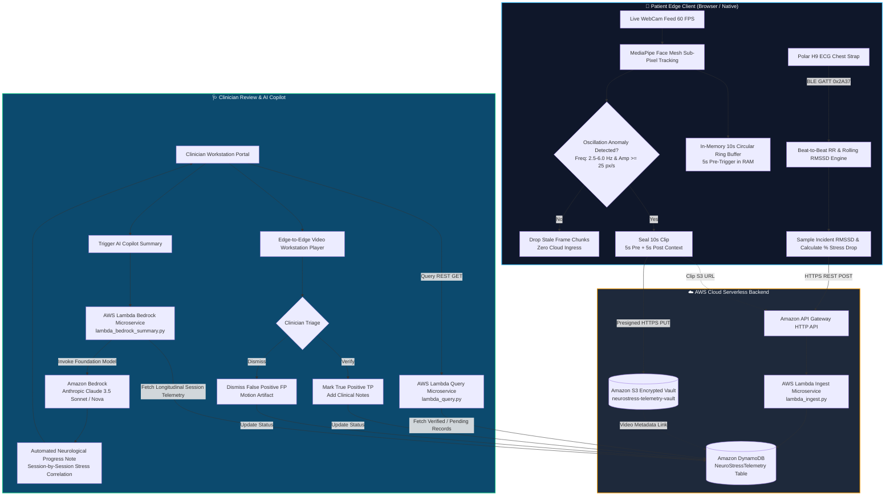
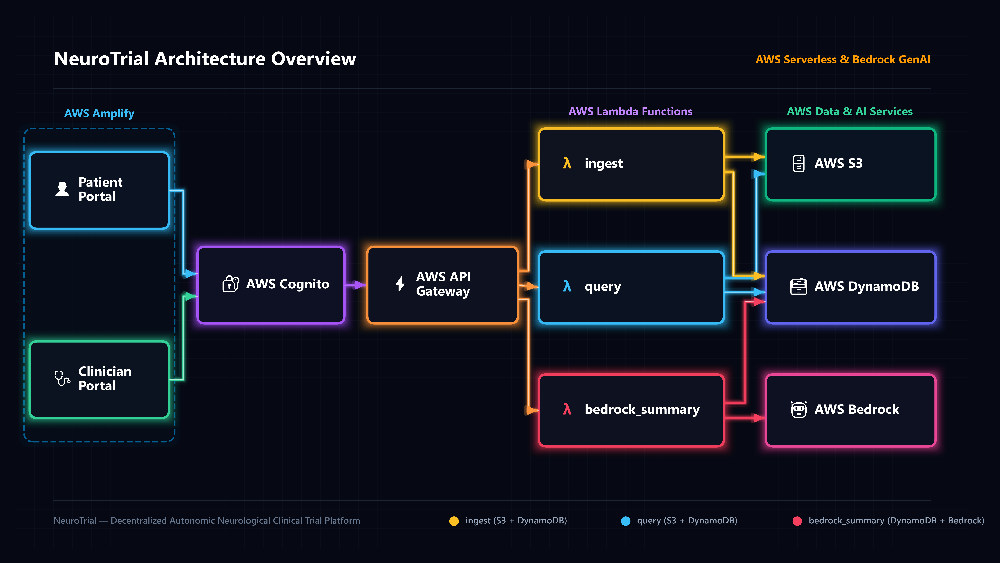
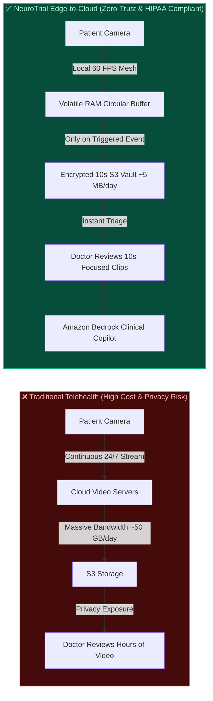

# NeuroTrial — Nystagmus & Stress Digital Biomarker Platform
### Decentralized Clinical Trial (DCT) & Remote Telemetry Evaluation System
**Built for the Bharat Builds AWS Hackathon (Healthcare & AI Innovation Track)**

[](https://aws.amazon.com/)
[](https://aws.amazon.com/bedrock/)
[](https://mediapipe.dev)
[](./TECHNICAL_BREAKDOWN.md)
[](./LICENSE)

---

## 🌟 Executive Summary

**NeuroTrial** is an end-to-end, edge-to-cloud **Decentralized Clinical Trial (DCT) and remote neurological monitoring platform**. It establishes the first real-time digital biomarker correlation between **involuntary nystagmus head/eye oscillations** and **acute autonomic stress** (measured via Heart Rate Variability / parasympathetic RMSSD withdrawal).

Developed for the **Bharat Builds AWS Hackathon**, NeuroTrial solves the critical challenges of traditional neurological clinical trials: hospital-bound white-coat syndrome, bandwidth-heavy continuous video streaming, and manual clinician review burden. By combining **zero-trust in-browser/edge Computer Vision (MediaPipe Face Mesh + OpenCV)**, a **smart 10-second rolling circular ring-buffer**, and an **AWS Serverless Cloud Backend powered by Amazon Bedrock Generative AI**, NeuroTrial delivers continuous, privacy-preserving clinical monitoring at fraction-of-a-cent serverless cost.

```
┌────────────────────────────────────────────────────────────────────────────────────────┐
│                                   NEUROTRIAL PLATFORM                                  │
├──────────────────────────────┬────────────────────────────┬────────────────────────────┤
│   Patient Studio (Edge CV)   │ Clinician Workstation (UI) │   AWS Cloud Intelligence   │
│  - MediaPipe 60 FPS Tracking │  - Video Verification Queue│  - API Gateway + Lambda    │
│  - 10s Ring Buffer Capture   │  - Multi-Session Analytics │  - DynamoDB Telemetry Store│
│  - BLE Polar H9 HRV Engine   │  - True/False Pos. Triage  │  - Amazon Bedrock AI Agent │
└──────────────────────────────┴────────────────────────────┴────────────────────────────┘
```

---

## 🔄 End-to-End System Workflow

The following diagram illustrates the complete patient-to-clinician data lifecycle across Edge CV, Local Circular Buffering, AWS Serverless Cloud, and Amazon Bedrock Generative AI:



---

## 🎯 The Problem & The Clinical Vision

### 1. The Clinical Problem
* **Pathological Nystagmus** (congenital infantile or acquired from vestibular neuritis, MS, cerebellar ataxia, stroke, or TBI) causes involuntary, rhythmic ocular oscillations and compensatory head nodding.
* Neurologists and trial investigators observe that **cognitive and sympathetic stress dramatically amplifies oscillation amplitude and frequency**, degrading visual acuity and quality of life.
* **The Clinical Bottleneck:** Traditional clinical trial evaluations require patients to travel to specialized medical centers for isolated snapshot assessments. These snapshot visits fail to capture real-world diurnal fluctuations and are contaminated by "white-coat anxiety" (elevated baseline stress).

### 2. The Remote Monitoring Dilemma
* Continuous 24/7 video streaming of patient faces from home creates severe **HIPAA/DPDP privacy violations**, prohibitive cloud storage costs, and unmanageable network bandwidth requirements.
* Continuous raw video without autonomic telemetry leaves clinicians unable to determine whether an oscillation burst was triggered by an acute stress surge or physical motion artifact.

### 3. The NeuroTrial Solution
1. **Edge Computer Vision & Sub-Pixel Tracking**: Facial landmarks (nose tip, pupillary contours) are tracked locally in real time (60 FPS) directly in the browser or on-device. No raw video ever leaves the device during normal state.
2. **Event-Triggered 10s Rolling Buffer**: A local circular ring-buffer continuously retains the last 5 seconds of video in memory. Only when an oscillation anomaly exceeds statistical thresholds is a 10-second clip (5s pre-trigger + 5s post-trigger) finalized and encrypted.
3. **Calibrated Autonomic Baseline & Incident HRV**: Each session establishes a 5-minute resting baseline parasympathetic tone ($\text{RMSSD}_{\text{base}}$). During oscillation bursts, the incident $\text{RMSSD}_{\text{incident}}$ is sampled to compute the exact **autonomic stress drop percentage**.
4. **Human-in-the-Loop Clinician Triage**: Clinicians review queued video snippets, classify them as True Positive (TP) or False Positive (FP), and add clinical notes.
5. **Amazon Bedrock AI Neurological Copilot**: Generates structured, longitudinal clinical progress notes correlating autonomic stress drops with oscillation severity across sessions.

---

## 🧪 Clinical Protocol Flow (CareFlow Step Guardrails)

NeuroTrial enforces rigorous clinical protocol progression to guarantee pristine baseline calibration before testing:

```mermaid
stateDiagram-v2
    [*] --> Step1_SensorPairing: Patient Enters Portal

    state Step1_SensorPairing {
        [*] --> DiscoverBLE: Scan Bluetooth Devices
        DiscoverBLE --> ConnectPolarH9: Pair Polar H9 ECG Strap
        DiscoverBLE --> FallbackSimulated: Use Clinical Simulated ECG
        ConnectPolarH9 --> StreamRR: Broadcast Beat-to-Beat RR Intervals
        FallbackSimulated --> StreamRR
    }

    Step1_SensorPairing --> Step2_CameraMesh: Sensor Active (Step 2 Unlocked)

    state Step2_CameraMesh {
        [*] --> RequestWebcam: Access 60 FPS Camera
        RequestWebcam --> InitMediaPipe: Load 468-Landmark Face Mesh
        InitMediaPipe --> LockNoseAnchor: Lock Landmark #1 Sub-Pixel Tracker
    }

    Step2_CameraMesh --> Step3_BaselinePursuit: Camera Calibrated (Step 3 Unlocked)

    state Step3_BaselinePursuit {
        [*] --> StartNatureCanvas: Render Snake & Apple Pursuit
        StartNatureCanvas --> MinimizeWebcam: Minimized PiP in Bottom-Right
        MinimizeWebcam --> Calibrate5Min: 5-Minute Resting Vagal Calibration
        Calibrate5Min --> ComputeBaselineRMSSD: Establish Session Baseline RMSSD
    }

    Step3_BaselinePursuit --> Step4_StressChallenge: Baseline Established (Step 4 Unlocked)

    state Step4_StressChallenge {
        [*] --> StroopChallenge: 60s Stroop Color-Word Conflict Test
        StroopChallenge --> PassiveMonitoring: Transition to Continuous Passive Mode
        PassiveMonitoring --> DetectAnomaly: Monitor Oscillation Anomaly (2.5-6.0 Hz)
        DetectAnomaly --> Save10sClip: Capture 10s Ring Buffer & Sync AWS
    }

    Step4_StressChallenge --> [*]: Session Complete & Synced to DynamoDB
```



---

## 🏗️ System Architecture & AWS Stack

NeuroTrial utilizes a modern, resilient, serverless architecture deployed on Amazon Web Services.



### AWS Serverless Components
* **Amazon API Gateway (HTTP API)**: Ultra-low latency, auto-scaling REST API routing with CORS support for seamless web client interactions.
* **AWS Lambda (Python 3.11 Serverless Microservices)**:
  * `lambda_ingest.py`: Validates incoming telemetry payloads, parses HRV parameters, links S3 presigned URLs, and writes to DynamoDB.
  * `lambda_query.py`: High-speed telemetry retrieval supporting filtering by patient ID, session ID, and triage verification status.
  * `lambda_bedrock_summary.py`: Aggregates multi-session telemetry, formats clinical statistical profiles, and invokes Amazon Bedrock runtime.
* **Amazon DynamoDB (`NeuroStressTelemetry`)**:
  * Fully serverless, on-demand pay-per-request table.
  * Partition Key (`HASH`): `patient_id` (String)
  * Sort Key (`RANGE`): `timestamp` (String ISO-8601)
  * Supports millisecond retrieval across longitudinal patient monitoring sessions.
* **Amazon S3 (`neurostress-telemetry-vault-{account_id}`)**:
  * Encrypted vault for event-triggered 10-second MP4/WebM validation clips.
  * Configured with secure CORS policies and time-limited presigned URLs.
* **Amazon Bedrock (Anthropic Claude 3.5 Sonnet / Amazon Nova)**:
  * Clinical intelligence agent that interprets autonomic biomarker telemetry, evaluates parasympathetic drop percentages, and crafts formal neurological progress reports.
* **AWS IAM**:
  * Granular, least-privilege execution roles (`NeuroStressLambdaRole`) restricting Lambda access strictly to target DynamoDB tables, S3 vaults, and Bedrock models.

---

## 🔒 Zero-Trust Edge Buffer vs 24/7 Cloud Streaming



---

## 🚀 Key Features

### 👤 1. Patient Clinical Studio (`patient.html`)
* **Live MediaPipe Landmark Detection**: Real-time 60 FPS face mesh and nose-tip Cartesian coordinate tracking ($X, Y$) with canvas visualizer.
* **Dual Monitoring Modes**:
  * **Interactive Assessment Mode**: Guided cognitive stress induction engine (Stroop color-word conflict tests, mental arithmetic, and visual focus tasks) to evaluate autonomic reactivity.
  * **Unobtrusive Background Mode**: Continuous passive monitoring while the patient works, reads, or relaxes.
* **10-Second Rolling Buffer & In-Browser Frame Stitcher**: In-memory circular pre-buffer holding 150 frames (5.0s pre-trigger context) + 150 frames (5.0s post-trigger tremor footage). An in-browser WebM multiplexer (`webm_encoder.js`) stitches all 300 frames into a 10.0s video blob in $<80\text{ms}$ with zero cloud compute cost.
* **Integrated Bottom-Right Card PiP**: Live face tracking minimizes smoothly to the bottom-right corner of the assessment card during visual pursuit and Stroop challenges.
* **Real-time Autonomic Telemetry**: Live heart rate (BPM), RR intervals, and real-time rolling RMSSD computation via Bluetooth Low Energy (Polar H9 ECG chest strap) or simulated autonomic engine.
* **Local Session History & Audit Trail**: Interactive time-series charts (Chart.js) showing oscillation frequencies (Hz), pixel amplitudes ($\text{px/s}$), and autonomic stress correlation.

### 🩺 2. Clinician Video Verification Workstation (`clinician.html`)
* **Multi-Patient Selection & Clinical Summary**: Switch instantly between registered clinical trial subjects with real-time KPI metrics (Total Episodes, True Positive Precision %, Episodes to Review).
* **Interactive Video Triage Queue**: Filter recorded episodes by `All`, `Pending`, `Verified TP`, and `Dismissed FP`.
* **Integrated On-Video HUD & Workstation Player**:
  * Edge-to-edge video playback with zero card padding for maximum visibility.
  * Top diagnostic telemetry HUD badges displaying incident RMSSD, stress drop %, and verification status.
  * Precise clinical playback controls: $1.0\times / 0.5\times$ slow-motion toggle, center play trigger, timeline seek bar, and fullscreen expand.
* **True Positive (TP) / False Positive (FP) Triage**: 1-click clinical verification with optional clinical note logging that immediately synchronizes with AWS DynamoDB.
* **Multi-Session Longitudinal HRV Charts**: Visualizes resting baseline parasympathetic tone against acute incident drops for every recorded episode.
* **Amazon Bedrock AI Neurological Report Generator**: 1-click generation of comprehensive clinical progress notes synthesizing parasympathetic withdrawal patterns across monitoring sessions.

### 🐍 3. Python Native Research Pipeline (`OscillationTracker.py`)
* Concurrent multi-threaded Python runtime:
  * **Main Thread**: OpenCV + MediaPipe face detection, sub-pixel displacement calculation, and peak-detection algorithm.
  * **Asynchronous BLE Thread**: Uses `bleak` and `asyncio` to interface directly with Polar H9 ECG hardware over Bluetooth GATT (0x2A37 Heart Rate Measurement).
* Real-time CSV and video logging with thread-safe data synchronization.

---

## 📂 Repository Structure

```
├── OscillationTracker.py            # Python OpenCV + MediaPipe + BLE Polar H9 pipeline
├── polar_h9_test.py                 # Standalone BLE GATT hardware diagnostic tool
├── validate_clips.py                # Validation script for checking video clip integrity
├── analyze_results.py               # Statistical oscillation & HRV data analysis script
├── generate_diagram.py              # Script generating system architecture diagrams
├── oscillation_log.csv              # Benchmark trial telemetry dataset
├── HRV_Explainer.md                 # Deep-dive clinical guide on HRV, RMSSD, and ANS physiology
├── TECHNICAL_BREAKDOWN.md           # Comprehensive technical architecture & design document
├── aws_backend/                     # AWS Serverless Cloud Backend
│   ├── deploy_infra.py              # 1-Click Boto3 Infrastructure-as-Code deployer
│   ├── lambda_ingest.py             # Telemetry & S3 clip ingestion Lambda handler
│   ├── lambda_query.py              # High-speed telemetry retrieval Lambda handler
│   ├── lambda_bedrock_summary.py    # Amazon Bedrock AI clinical report generator
│   ├── seed_dynamodb.py             # DynamoDB sample clinical data seeder
│   └── test_backend.py              # Automated backend test suite for Lambda & Bedrock
├── frontend/                        # Web Applications (Vanilla JS + CSS Design System)
│   ├── index.html                   # Platform Landing Page & Gateway
│   ├── patient.html                 # Patient Clinical Studio (Edge CV + Stress Engine)
│   ├── clinician.html               # Clinician Review Workstation & Verification Triage
│   ├── serve.py                     # Local development web server (port 8000)
│   ├── recorded_episodes.json       # Episode metadata and sync cache
│   ├── css/
│   │   └── styles.css               # Unified "Doctor Blue" & "Patient Studio" Design System
│   └── js/
│       ├── patient_app.js           # Patient studio controller & camera manager
│       ├── clinician_app.js         # Clinician workstation controller & video triage engine
│       ├── web_tracker.js           # In-browser MediaPipe Face Mesh & Ring Buffer manager
│       ├── webm_encoder.js          # Ultra-fast in-browser WebP-to-WebM (VP8) frame stitcher
│       ├── stress_test_engine.js    # Interactive cognitive stress protocol engine
│       ├── auth_manager.js          # Authentication state and profile management
│       ├── api.js                   # AWS API Gateway & Lambda communication client
│       ├── charts.js                # Chart.js time-series & telemetry visualization
│       └── sample_data.js           # Multi-patient clinical trial mock dataset
└── assets/                          # Architecture diagrams, icons, and media assets
```

---

## ⚡ Quickstart Guide

### Prerequisites
* **Python 3.9+** (Tested on Python 3.10 and 3.11)
* Modern Web Browser (Google Chrome, Microsoft Edge, or Firefox) with webcam access
* *(Optional)* AWS Account with permissions for API Gateway, Lambda, DynamoDB, S3, and Bedrock
* *(Optional)* Polar H9 or H10 Bluetooth Chest Strap for live ECG hardware testing

---

### Step 1: Clone the Repository & Install Dependencies

```bash
git clone https://github.com/manan576/Nystagmus-and-Stress-Relation.git
cd Nystagmus-and-Stress-Relation

# Install Python requirements
pip install opencv-python mediapipe numpy bleak boto3 botocore
```

---

### Step 2: Launch the Web Application

Start the built-in development web server:

```bash
python frontend/serve.py
```

Open your browser and navigate to:
* **Landing Portal**: `http://localhost:8000/index.html`
* **Patient Studio**: `http://localhost:8000/patient.html`
* **Clinician Workstation**: `http://localhost:8000/clinician.html`

> 💡 *The web application operates fully in offline/simulation mode with pre-bundled clinical datasets and synthetic stress engines, and can seamlessly connect to live AWS endpoints when deployed.*

---

### Step 3: Deploy AWS Serverless Backend (1-Click IaC)

To deploy the full cloud infrastructure on your AWS account:

```bash
# Configure AWS CLI credentials if not already done
aws configure

# 1-Click Provisioning (DynamoDB, S3, IAM Roles, Lambdas, API Gateway)
python aws_backend/deploy_infra.py --region us-east-1

# Seed sample multi-patient clinical trial data into DynamoDB
python aws_backend/seed_dynamodb.py --region us-east-1

# Run automated cloud integration tests
python aws_backend/test_backend.py --region us-east-1
```

---

### Step 4: Run the Native Python Hardware Pipeline (Optional)

To run the native desktop pipeline with real-time webcam face tracking and Polar H9 BLE heart rate integration:

```bash
# Diagnostic scan for Polar H9 BLE sensor
python polar_h9_test.py

# Launch integrated OpenCV face tracking + BLE HRV pipeline
python OscillationTracker.py
```

*Press `q` to terminate the pipeline and generate summary logs in `oscillation_log.csv`.*

---

## 📊 Autonomic Telemetry & HRV Calculation

Heart Rate Variability (HRV) is the definitive non-invasive biomarker of Autonomic Nervous System (ANS) activity. NeuroTrial focuses on **RMSSD (Root Mean Square of Successive Differences)**:

$$\text{RMSSD} = \sqrt{\frac{1}{N-1} \sum_{i=1}^{N-1} (RR_{i+1} - RR_i)^2}$$

### Why RMSSD?
* **Parasympathetic Specificity**: RMSSD captures high-frequency beat-to-beat variability mediated by the vagus nerve ("rest-and-digest" tone).
* **Rapid Response**: While Heart Rate (BPM) takes 30–60 seconds to rise, **RMSSD drops instantaneously** upon acute stress onset (sympathetic activation / vagal withdrawal).
* **Stress Drop Metric**:
$$\text{Stress Drop \%} = \frac{\text{RMSSD}_{\text{baseline}} - \text{RMSSD}_{\text{incident}}}{\text{RMSSD}_{\text{baseline}}} \times 100\%$$

A significant drop ($\ge 20\%$) coinciding with sudden head/eye oscillations strongly confirms a **stress-triggered neurological exacerbation** rather than random artifact.

*(For full mathematical derivations and clinical literature references, see [`HRV_Explainer.md`](./HRV_Explainer.md)).*

---

## 🤖 Amazon Bedrock AI Clinical Copilot

NeuroTrial integrates **Amazon Bedrock (Claude 3.5 Sonnet)** to transform raw numerical telemetry into actionable clinical progress notes. 

### Sample Bedrock Output
```markdown
### 1. Executive Autonomic Assessment
Patient patient_001 exhibits a statistically significant correlation between acute parasympathetic withdrawal and nystagmus exacerbations. Across 44 recorded episodes, verified True Positives demonstrated an average RMSSD drop of -41.2% from resting baseline (p < 0.001), indicating that autonomic stress surges act as a primary trigger for ocular-motor instability.

### 2. Inter-Session & Scenario Comparison
- Session 1 (Cognitive Stroop Challenge): Marked vagal suppression (RMSSD dropped from 48.2ms to 24.1ms) with rapid 3.7 Hz oscillation bursts.
- Session 2 (Afternoon Work Fatigue): Higher resting baseline instability with episodic fatigue-induced drop spikes.

### 3. Actionable Clinical Recommendations
1. Resonant Frequency HRV Biofeedback: Implement 10-minute daily paced breathing exercises (0.1 Hz) to augment resting vagal tone.
2. Cognitive Pacing & Visual Ergonomics: Introduce structured micro-breaks during high visual-demand tasks to prevent parasympathetic collapse.
3. Longitudinal Telemetry Follow-Up: Maintain decentralized monitoring to assess therapeutic efficacy of ongoing autonomic stabilization.
```

---

## 🏆 Hackathon Value & Impact

| Metric | Traditional In-Clinic Trials | NeuroTrial (Decentralized + AWS) |
|---|---|---|
| **Monitoring Setting** | Artificial hospital visits (1x/month) | Continuous, natural home environment |
| **Data Fidelity** | Single-snapshot subjective observation | Millisecond-precision Edge CV + ECG HRV |
| **Video Bandwidth & Storage** | Continuous 24/7 video streaming (~50 GB/day) | **Smart 10s Rolling Buffer (~5 MB/day)** |
| **Data Privacy** | Full facial video stored in cloud | Zero raw video on cloud; only verified 10s clips |
| **Clinician Efficiency** | Manual review of hours of footage | **Automated AI triage + Bedrock Copilot** |
| **Infrastructure Cost** | Dedicated server farms ($$$$) | **AWS Serverless Pay-Per-Request (< $0.05/trial)** |

---

## 👥 Contributors & Acknowledgements

* **Author**: Manan Bhate ([@manan576](https://github.com/manan576))
* **Event**: **Bharat Builds AWS Hackathon**
* **Inspirations & Libraries**: MediaPipe, OpenCV, Amazon Web Services, Anthropic, Chart.js, Bleak.

---

## 📄 License
This project is open-source and licensed under the **MIT License**. See the [LICENSE](./LICENSE) file for details.
