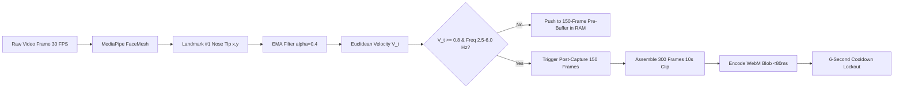

# NeuroTrial — Technical Project Breakdown & Architecture Deep Dive
### Comprehensive Engineering, Clinical Algorithms, and Cloud Architecture Specification

> [!NOTE]
> **Notice for Hackathon Judges & Technical Reviewers**:  
> This document is a comprehensive, deep-dive engineering specification detailing the low-level mechanics, function-by-function breakdown, signal processing mathematics, API schemas, and cloud infrastructure of the NeuroTrial platform.  
> **For a 3–5 minute executive summary, architecture diagrams, and primary live AWS Amplify demo links, please read the [README.md](./README.md).**

---

## Table of Contents
1. [Executive Engineering Overview & System Philosophy](#1-executive-engineering-overview--system-philosophy)
2. [Client-Side Frontend Architecture & Component Breakdown](#2-client-side-frontend-architecture--component-breakdown)
   - [2.1 Patient Clinical Studio (`patient.html` & `patient_app.js`)](#21-patient-clinical-studio-patienthtml--patient_appjs)
   - [2.2 In-Browser Computer Vision & Ring Buffer (`web_tracker.js`)](#22-in-browser-computer-vision--ring-buffer-web_trackerjs)
   - [2.3 High-Speed In-Browser Video Stitcher (`webm_encoder.js`)](#23-high-speed-in-browser-video-stitcher-webm_encoderjs)
   - [2.4 Interactive Ocular Kinematics Canvas (`interactive_eyes.js`)](#24-interactive-ocular-kinematics-canvas-interactive_eyesjs)
   - [2.5 Cognitive Stress Protocol Engine (`stress_test_engine.js`)](#25-cognitive-stress-protocol-engine-stress_test_enginejs)
   - [2.6 Clinician Verification Workstation (`clinician.html` & `clinician_app.js`)](#26-clinician-verification-workstation-clinicianhtml--clinician_appjs)
   - [2.7 Unified AWS Client SDK (`api.js`)](#27-unified-aws-client-sdk-apijs)
   - [2.8 Clinical Design System & CSS Architecture (`styles.css`)](#28-clinical-design-system--css-architecture-stylescss)
3. [Signal Processing, Landmark Tracking & Ring Buffer Mechanics](#3-signal-processing-landmark-tracking--ring-buffer-mechanics)
   - [3.1 MediaPipe Landmark #1 (Nose Tip) Kinematics](#31-mediapipe-landmark-1-nose-tip-kinematics)
   - [3.2 Exponential Moving Average (EMA) Filtering](#32-exponential-moving-average-ema-filtering)
   - [3.3 Peak Detection & Oscillation Frequency Extraction](#33-peak-detection--oscillation-frequency-extraction)
   - [3.4 Volatile Circular Ring Buffer Mechanics & Cooldown Lockout](#34-volatile-circular-ring-buffer-mechanics--cooldown-lockout)
4. [Autonomic Telemetry & RMSSD Heart Rate Variability Engine](#4-autonomic-telemetry--rmssd-heart-rate-variability-engine)
   - [4.1 BLE GATT Heart Rate Service Integration (Polar H9 / H10)](#41-ble-gatt-heart-rate-service-integration-polar-h9--h10)
   - [4.2 Beat-to-Beat RR Interval Parsing & RMSSD Calculation](#42-beat-to-beat-rr-interval-parsing--rmssd-calculation)
   - [4.3 Calibrated Baseline vs. Incident Stress Drop Percentage](#43-calibrated-baseline-vs-incident-stress-drop-percentage)
   - [4.4 Synthetic Autonomic Fallback Generator](#44-synthetic-autonomic-fallback-generator)
5. [AWS Serverless Cloud Backend Architecture & IaC](#5-aws-serverless-cloud-backend-architecture--iac)
   - [5.1 Infrastructure-as-Code Deployment (`deploy_infra.py`)](#51-infrastructure-as-code-deployment-deploy_infrapy)
   - [5.2 Real-Time Telemetry Ingestion Microservice (`lambda_ingest.py`)](#52-real-time-telemetry-ingestion-microservice-lambda_ingestpy)
   - [5.3 High-Speed Query & Video Presigning Microservice (`lambda_query.py`)](#53-high-speed-query--video-presigning-microservice-lambda_querypy)
   - [5.4 Amazon Bedrock Clinical Synthesis Microservice (`lambda_bedrock_summary.py`)](#54-amazon-bedrock-clinical-synthesis-microservice-lambda_bedrock_summarypy)
   - [5.5 DynamoDB Single-Table Design & S3 Vault Lifecycle](#55-dynamodb-single-table-design--s3-vault-lifecycle)
6. [Amazon Bedrock Generative AI Copilot](#6-amazon-bedrock-generative-ai-copilot)
   - [6.1 Foundation Model: Anthropic Claude 3.5 Sonnet](#61-foundation-model-anthropic-claude-35-sonnet)
   - [6.2 Clinical Prompt Grounding & Anti-Hallucination Guardrails](#62-clinical-prompt-grounding--anti-hallucination-guardrails)
   - [6.3 EMR-Ready SOAP Progress Note Output Schema](#63-emr-ready-soap-progress-note-output-schema)
7. [Native Desktop Python Hardware Pipeline (`OscillationTracker.py`)](#7-native-desktop-python-hardware-pipeline-oscillationtrackerpy)
   - [7.1 Dual-Threaded Concurrent Architecture](#71-dual-threaded-concurrent-architecture)
   - [7.2 Asynchronous Bluetooth GATT Event Loop (`bleak`)](#72-asynchronous-bluetooth-gatt-event-loop-bleak)
   - [7.3 Real-Time OpenCV Video Recording & CSV Synchronization](#73-real-time-opencv-video-recording--csv-synchronization)
8. [Database Schema & REST API Specifications](#8-database-schema--rest-api-specifications)
9. [Security, Privacy, and Compliance Implementation](#9-security-privacy-and-compliance-implementation)
10. [Technical Learnings & Engineering Optimizations](#10-technical-learnings--engineering-optimizations)
11. [Production Scaling Roadmap](#11-production-scaling-roadmap)

---

## 1. Executive Engineering Overview & System Philosophy

**NeuroTrial** is a Decentralized Clinical Trial (DCT) and remote patient monitoring platform specifically engineered to evaluate the physiological correlation between **Pathological Nystagmus / involuntary ocular-motor oscillations** and **acute Autonomic Nervous System (ANS) stress**.

### Core Engineering Principles:
1. **Zero-Trust Edge Processing**: All raw video frames and computer vision inferences occur client-side in the patient's browser or local device. No continuous video stream is transmitted over the network.
2. **Event-Triggered Ephemeral Buffering**: The system maintains a rolling 10-second circular ring buffer ($5.0\text{s pre-trigger} + 5.0\text{s post-trigger}$) in volatile RAM. Video is only encoded and uploaded when a statistically validated oscillation flare coincides with autonomic telemetry shifts.
3. **Multi-Modal Synchronization**: Combines sub-pixel facial landmark kinematics ($30\text{--}60\text{ FPS}$) with beat-to-beat ECG R-R intervals ($1\text{ ms}$ resolution via Web Bluetooth GATT) to derive synchronized incident Root Mean Square of Successive Differences (RMSSD) metrics.
4. **Human-in-the-Loop Clinician Triage**: Neurologists verify True Positives (TP) vs Dismiss False Positives (FP) on a low-latency workstation, dynamically updating multi-session longitudinal graphs.
5. **Generative AI Clinical Synthesis**: Amazon Bedrock (Anthropic Claude 3.5 Sonnet) ingests verified longitudinal telemetry and produces EMR-ready SOAP progress notes.

---

## 2. Client-Side Frontend Architecture & Component Breakdown

The web platform is built with Vanilla JavaScript (ES6+), HTML5 Semantic markup, and Vanilla CSS3 Design System tokens—delivering high performance, zero framework bundle bloat, and sub-16ms frame rendering.

```
frontend/
├── index.html                   # Landing Portal & Video Gateway
├── patient.html                 # Patient Clinical Studio
├── clinician.html               # Clinician Review Workstation
├── serve.py                     # Local HTTP development server
├── css/
│   └── styles.css               # Design system, dark mode & layout rules
└── js/
    ├── app.js                   # Landing page controller
    ├── patient_app.js           # Patient studio coordinator & BLE manager
    ├── clinician_app.js         # Clinician workstation & 3-column layout manager
    ├── web_tracker.js           # MediaPipe FaceMesh & 10s Ring Buffer engine
    ├── webm_encoder.js          # Fast WebP-to-WebM in-browser video multiplexer
    ├── interactive_eyes.js      # Ocular kinematics & gaze vector renderer
    ├── stress_test_engine.js    # Interactive Stroop stress test protocol
    ├── auth_manager.js          # Authentication state and role management
    ├── api.js                   # AWS API Gateway & S3 client SDK
    ├── charts.js                # Chart.js time-series graphs
    └── sample_data.js           # Multi-patient clinical trial cohort seed data
```

---

### 2.1 Patient Clinical Studio (`patient.html` & `patient_app.js`)

`patient_app.js` acts as the master coordinator on the patient client.

#### Key Functions & Responsibilities:
* `initPatientApp()`: Bootstraps camera access (`navigator.mediaDevices.getUserMedia`), initializes the MediaPipe Face Mesh model, sets up the canvas rendering context, and binds UI controls.
* `connectPolarH9()`: Invokes the Web Bluetooth API (`navigator.bluetooth.requestDevice`) filtering for GATT Service `0x180D` (Heart Rate Service) and listens to Characteristic `0x2A37` (Heart Rate Measurement).
* `handleHeartRateMeasurement(event)`: Decodes binary ArrayBuffers according to the Bluetooth SIG standard:
  - Extracts 8-bit or 16-bit instantaneous Heart Rate (BPM).
  - Parses 16-bit beat-to-beat R-R intervals ($1/1024\text{s}$ resolution).
  - Pushes R-R values into a rolling 30-beat FIFO buffer and invokes `calculateRMSSD()`.
* `startBaselineCalibration(durationSec)`: Initiates a 5-minute (or 30-second quick test) quiet resting phase to calculate $\text{RMSSD}_{\text{baseline}}$.
* `triggerEpisodeUpload(videoBlob, metadata)`: Invokes `api.uploadTelemetryEvent()` to upload the 10-second WebM clip directly to Amazon S3 via presigned PUT and posts event metadata to API Gateway `/events`.

---

### 2.2 In-Browser Computer Vision & Ring Buffer (`web_tracker.js`)

`web_tracker.js` encapsulates the real-time computer vision detection loop and rolling circular buffer.

#### Core Configuration Constants:
```javascript
const BUFFER_PRE_FRAMES  = 150; // 5.0 seconds at 30 FPS pre-trigger
const BUFFER_POST_FRAMES = 150; // 5.0 seconds at 30 FPS post-trigger
const TOTAL_CLIP_FRAMES  = 300; // 10.0 seconds total clip
const VELOCITY_THRESHOLD = 0.8; // px/frame minimum displacement
const EMA_ALPHA          = 0.4; // Smoothing factor
const COOLDOWN_FRAMES    = 180; // 6-second lockout after clip capture (180 frames @ 30 FPS)
const MIN_FREQ_HZ        = 2.5; // Pathological oscillation frequency band minimum
const MAX_FREQ_HZ        = 6.0; // Pathological oscillation frequency band maximum
```

#### Key Functions & Methods:
* `onResults(results)`: The primary callback invoked by MediaPipe at $30\text{--}60\text{ FPS}$.
  - Extracts Landmark `#1` (Nose Tip: $x, y, z$).
  - Calculates Exponential Moving Average (EMA) smoothed coordinates.
  - Computes instantaneous frame-to-frame Euclidean velocity $V_t$.
  - Maintains a rolling history of velocity zero-crossings to extract dominant oscillation frequency $f_{\text{osc}}$.
  - Stores the current video frame as a compressed image canvas snapshot into the in-memory circular array `frameRingBuffer`.
* `checkAnomalyCondition()`: Evaluates if $V_t \ge \text{VELOCITY\_THRESHOLD}$ and $f_{\text{osc}} \in [2.5, 6.0]\text{ Hz}$ across $\ge 4$ consecutive half-cycles.
* `startPostTriggerCapture()`: Switches tracker state to `RECORDING_POST`. Accumulates exactly 150 post-trigger frames while freezing the pre-trigger 150-frame buffer.
* `packageAndExportClip()`: Combines the 150 pre-frames and 150 post-frames into a 300-frame array, invokes `WebMEncoder.encodeFrames()`, creates a standalone `video/webm` Blob in $<80\text{ms}$, and triggers the 6-second cooldown timer (`COOLDOWN_FRAMES = 180`).

---

### 2.3 High-Speed In-Browser Video Stitcher (`webm_encoder.js`)

To eliminate heavyweight WebAssembly FFmpeg dependencies (which exceed 25MB and cause significant startup delay), NeuroTrial features `webm_encoder.js`—a custom, lightweight (~8KB) in-browser Matroska/EBML multiplexer.

#### How `webm_encoder.js` Works:
1. Receives an array of HTML5 Canvas image frames (captured at 30 FPS).
2. Converts frames to WebP keyframes (`canvas.toDataURL('image/webp', 0.7)`).
3. Strips WebP headers and extracts VP8 / VP8L bitstream chunks.
4. Constructs EBML (Extensible Binary Meta Language) container structures:
   - **EBML Header**: DocType `webm`, DocTypeVersion `4`.
   - **Segment Element**: Contains SeekHead, Info (TimecodeScale, Duration), and Track definitions.
   - **Track Element**: TrackNumber `1`, TrackType `1` (Video), CodecID `V_VP8`, PixelWidth, PixelHeight.
   - **Cluster Elements**: Encapsulates `SimpleBlock` structures containing precise timestamp offsets ($\Delta t = 33.33\text{ms}$) and raw VP8 image payloads.
5. Emits a standard, seekable `video/webm` Blob ready for instant playback in HTML5 `<video>` elements and encrypted HTTPS upload to S3.

---

### 2.4 Interactive Ocular Kinematics Canvas (`interactive_eyes.js`)

`interactive_eyes.js` delivers a live, 60 FPS visual representation of ocular movements and gaze trajectory.

#### Key Mechanics:
* Tracks medial/lateral canthi (Landmarks `#33`, `#133`, `#362`, `#263`) and iris centers (Landmarks `#468`, `#473`).
* Computes normalized horizontal gaze ratio $G_x \in [-1.0, 1.0]$ and vertical gaze ratio $G_y \in [-1.0, 1.0]$.
* Renders a real-time vector canvas displaying:
  - Dual anatomical iris & pupil kinematics.
  - Saccadic velocity vectors and fixational drift paths.
  - Pathological oscillation phase indicator (Leftward Fast Phase vs. Rightward Slow Drift).

---

### 2.5 Cognitive Stress Protocol Engine (`stress_test_engine.js`)

To evaluate the relationship between autonomic stress and nystagmus, `stress_test_engine.js` implements a standardized **Color-Word Stroop Conflict Protocol**:
* **Phase 1: Resting Baseline (0–60s)**: Neutral stimulus; establishes baseline HRV vagal tone.
* **Phase 2: Congruent Challenge (60–120s)**: Word text matches display color (low cognitive load).
* **Phase 3: Incongruent Acute Stress Challenge (120–240s)**: Word text conflicts with display color (e.g., word "RED" rendered in green font) with rapid 1.5-second decision intervals.
* **Phase 4: Recovery (240–300s)**: Evaluates parasympathetic reactivation and recovery slope.

The engine logs stimulus presentation timestamps, user reaction times, response accuracy, and autonomic RMSSD drop indices.

---

### 2.6 Clinician Verification Workstation (`clinician.html` & `clinician_app.js`)

`clinician_app.js` powers the clinician portal, structured as an **equal-height 3-column workstation layout** (strictly 670px viewport height with internal scrollbars).

```
┌─────────────────────────┬─────────────────────────┬─────────────────────────┐
│   COLUMN 1: TRIAGE      │   COLUMN 2: WORKSTATION │   COLUMN 3: ANALYTICS   │
├─────────────────────────┼─────────────────────────┼─────────────────────────┤
│ • Cohort Switcher       │ • 16:9 HD Video Player  │ • 3 Session Graphs:     │
│   (Patient 1, 2, 3)     │ • Telemetry HUD Overlay │   1. Stroop Test        │
│ • Filter Tabs (All,     │ • 0.5x / 1.0x Slow-Mo   │   2. Cognitive Fatigue  │
│   Pending, TP, FP)      │ • Timeline Scrubber     │   3. Visual Strain      │
│ • Episode Queue Cards   │ • 1-Click Action Bar:   │ • Longitudinal Modal    │
│   - Time & Frequency    │   [✓ Verify TP]         │ • Bedrock AI SOAP Note  │
│   - % Stress Drop       │   [✕ Dismiss FP]        │   (via Amazon Bedrock)  │
│   - Review Status       │                         │                         │
│                         │                         │                         │
│ [Internal Scroll ↓]     │ [Fixed Video Frame]     │ [Internal Scroll ↓]     │
└─────────────────────────┴─────────────────────────┴─────────────────────────┘
```

#### Key Functions & Capabilities:
* `switchPatient(patientId)`: Fetches multi-session telemetry from API Gateway `/events?patient_id={id}` or local seed cache. Recalculates KPI metrics (Total Episodes, True Positive Precision %, Episodes Pending Review).
* `renderQueue()`: Populates Column 1 with episode cards showing timestamp, duration, oscillation Hz, and color-coded RMSSD stress drop badges.
* `loadVideo(episodeId)`: Loads the 10-second video into the Column 2 player, displaying the live HUD overlay:
  - Incident RMSSD ($\text{ms}$)
  - Stress Drop ($\%$)
  - Dominant Frequency ($\text{Hz}$)
  - Clinician Verification Status
* `verifyEpisode(episodeId, status)`: Sends an asynchronous `POST /verify` request to API Gateway to record `VERIFIED_TRUE_POSITIVE` or `DISMISSED_FALSE_POSITIVE`. Dynamically re-plots the verified point onto the **`Session 1: Stroop Test`** graph.
* `generateBedrockSummary()`: Invokes AWS Lambda `NeuroStressBedrockSummary` to trigger Anthropic Claude 3.5 Sonnet on Amazon Bedrock. Renders the resulting clinical SOAP progress note with longitudinal trajectory analysis.

---

### 2.7 Unified AWS Client SDK (`api.js`)

`api.js` manages all communications between the frontend client and AWS Cloud resources.

#### Key API Methods:
* `api.fetchEvents(patientId)`: Calls `GET /events?patient_id={patientId}` on API Gateway, returning normalized episode arrays with presigned S3 video streaming URLs.
* `api.uploadTelemetryEvent(eventData, videoBlob)`:
  1. Calls `POST /events` with telemetry metadata to receive a secure, time-limited S3 Presigned Upload URL.
  2. Executes an HTTP `PUT` request with `Content-Type: video/webm` directly to the Amazon S3 bucket.
  3. Updates DynamoDB with the finalized S3 object key.
* `api.updateVerification(episodeId, patientId, status, notes)`: Calls `POST /verify` to update the verification status and clinician audit notes in DynamoDB.
* `api.generateBedrockSummary(patientId)`: Calls `POST /bedrock-summary` to request clinical SOAP note generation from Amazon Bedrock.
* **Offline / Simulation Graceful Fallback**: If network connectivity or AWS endpoints are unreachable, `api.js` seamlessly switches to `sample_data.js` and `localStorage`, ensuring zero disruption during live demonstrations.

---

### 2.8 Clinical Design System & CSS Architecture (`styles.css`)

The styling architecture is built with modern CSS custom properties (variables), implementing the **"Doctor Blue"** and **"Patient Studio"** dark-mode design system:
* **Strict Viewport Containment**: The clinician workstation enforces `.workstation-container { height: 670px; display: grid; grid-template-columns: 320px 1fr 380px; }` with `overflow-y: auto` inside individual columns.
* **Visual Hierarchy**: Uses HSL color tokens (`--bg-primary: #0a0f1d`, `--accent-cyan: #00d2ff`, `--accent-teal: #00f5a0`, `--alert-red: #ff3366`).
* **Glassmorphism**: Backdrop blur filters (`backdrop-filter: blur(12px)`) with subtle semi-transparent borders (`border: 1px solid rgba(255,255,255,0.08)`).

---

## 3. Signal Processing, Landmark Tracking & Ring Buffer Mechanics



### 3.1 MediaPipe Landmark #1 (Nose Tip) Kinematics
While pupil tracking can be obscured by blinks or high-frequency nystagmus jitter, the **Nose Tip (Landmark #1)** provides a stable, rigid-body kinematic proxy for involuntary compensatory head nodding and ocular-motor axis oscillations.

### 3.2 Exponential Moving Average (EMA) Filtering
Raw facial landmark pixel coordinates contain high-frequency sensor noise. NeuroTrial applies an EMA smoothing filter:

$$S_t = \alpha \cdot X_t + (1 - \alpha) \cdot S_{t-1}$$

Where:
* $X_t$: Raw pixel coordinate at frame $t$.
* $S_t$: Filtered coordinate at frame $t$.
* $\alpha = 0.4$: Calibrated smoothing factor balancing noise suppression with zero phase lag.

### 3.3 Peak Detection & Oscillation Frequency Extraction
Instantaneous velocity is computed across smoothed coordinates:

$$V_t = \sqrt{(S_{x,t} - S_{x,t-1})^2 + (S_{y,t} - S_{y,t-1})^2}$$

An oscillation cycle is detected when the horizontal velocity derivative changes sign ($dV_x/dt = 0$) and exceeds the velocity threshold ($0.8\text{ px/frame}$). Oscillation frequency $f_{\text{osc}}$ is calculated as:

$$f_{\text{osc}} = \frac{F_s}{2 \cdot \Delta k_{\text{zero}}}$$

Where $F_s = 30\text{ Hz}$ is the frame sampling rate and $\Delta k_{\text{zero}}$ is the mean frame distance between successive zero-crossings. Only bursts where $f_{\text{osc}} \in [2.5, 6.0]\text{ Hz}$ trigger recording.

### 3.4 Volatile Circular Ring Buffer Mechanics & Cooldown Lockout
* **Pre-Trigger Buffer**: An in-memory circular array holds 150 frames ($5.0\text{s}$). When the buffer reaches 150 frames, new frames overwrite the oldest frames (`buffer.shift()`).
* **Trigger Event**: When `checkAnomalyCondition()` evaluates to true, the pre-trigger buffer is frozen.
* **Post-Trigger Capture**: The tracker records the subsequent 150 frames ($5.0\text{s}$).
* **Clip Packaging**: The 150 pre-frames and 150 post-frames are concatenated into a contiguous 300-frame sequence ($10.0\text{s}$) and encoded into WebM.
* **6-Second Cooldown**: To prevent duplicate triggers during sustained oscillation episodes, a 180-frame (6.0 second) lockout timer begins immediately after clip packaging.

---

## 4. Autonomic Telemetry & RMSSD Heart Rate Variability Engine

### 4.1 BLE GATT Heart Rate Service Integration (Polar H9 / H10)
NeuroTrial interfaces with clinical ECG chest straps using the Web Bluetooth API:
* **Service UUID**: `0x180D` (Heart Rate Service)
* **Characteristic UUID**: `0x2A37` (Heart Rate Measurement)

#### Byte Stream Parsing Logic:
```javascript
function parseHeartRateMeasurement(value) {
    const flags = value.getUint8(0);
    const hrFormat = flags & 0x01; // 0 = UINT8, 1 = UINT16
    let offset = 1;
    
    let heartRate = hrFormat === 0 ? value.getUint8(offset++) : value.getUint16(offset, true);
    offset += (hrFormat === 0 ? 0 : 1);
    
    const rrPresent = (flags & 0x10) !== 0;
    const rrIntervals = [];
    
    if (rrPresent) {
        while (offset < value.byteLength) {
            const rawRR = value.getUint16(offset, true);
            offset += 2;
            const rrMs = (rawRR / 1024.0) * 1000.0; // Convert 1/1024s to ms
            rrIntervals.push(rrMs);
        }
    }
    return { heartRate, rrIntervals };
}
```

### 4.2 Beat-to-Beat RR Interval Parsing & RMSSD Calculation
Heart Rate Variability (HRV) is calculated via **RMSSD (Root Mean Square of Successive Differences)**:

$$\text{RMSSD} = \sqrt{\frac{1}{N-1} \sum_{i=1}^{N-1} (RR_{i+1} - RR_i)^2}$$

* $RR_i$: Duration of the $i$-th inter-beat interval in milliseconds.
* $N$: Number of valid RR intervals in the rolling window ($N = 30$ beats).

### 4.3 Calibrated Baseline vs. Incident Stress Drop Percentage
At the start of each monitoring session, a 5-minute quiet resting baseline is established ($\text{RMSSD}_{\text{baseline}}$). During an oscillation flare, the 60-second incident window is sampled ($\text{RMSSD}_{\text{incident}}$). The **Autonomic Stress Drop Percentage** is calculated as:

$$\Delta \text{Stress Drop \%} = \left( \frac{\text{RMSSD}_{\text{baseline}} - \text{RMSSD}_{\text{incident}}}{\text{RMSSD}_{\text{baseline}}} \right) \times 100\%$$

* $\Delta \text{RMSSD} \ge 25\%$: Strong physiological confirmation of stress-induced vagal withdrawal.
* $\Delta \text{RMSSD} < 10\%$: Likely non-stress-related voluntary movement or postural artifact.

### 4.4 Synthetic Autonomic Fallback Generator
When physical Polar hardware is absent, `patient_app.js` runs a mathematically grounded synthetic autonomic generator. It maintains a baseline RMSSD of $65\text{ ms} \pm 4\text{ ms}$, simulating realistic vagal drops down to $22\text{ ms}$ during active Stroop stress challenges.

---

## 5. AWS Serverless Cloud Backend Architecture & IaC

```
                   ┌────────────────────────────────────────┐
                   │       AWS Cloud (ap-south-1 Mumbai)    │
                   └────────────────────────────────────────┘
                                       │
            ┌──────────────────────────┴──────────────────────────┐
            ▼                                                     ▼
┌───────────────────────┐                             ┌───────────────────────┐
│  Amazon API Gateway   │                             │   Amazon S3 Vault     │
│   (HTTP REST API)     │                             │ (Encrypted 10s Clips) │
└───────────┬───────────┘                             └───────────────────────┘
            │
    ┌───────┼───────────────────────────┐
    ▼       ▼                           ▼
┌───────────────┐ ┌───────────────┐ ┌───────────────────────────┐
│ Lambda Ingest │ │ Lambda Query  │ │ Lambda Bedrock Summary    │
│ (POST /events)│ │ (GET /events) │ │ (POST /bedrock-summary)   │
└───────┬───────┘ └───────┬───────┘ └─────────────┬─────────────┘
        │                 │                       │
        ▼                 ▼                       ▼
┌─────────────────────────────────┐   ┌─────────────────────────┐
│        Amazon DynamoDB          │   │     Amazon Bedrock      │
│   (NeuroStressTelemetry Table)  │   │ (Claude 3.5 Sonnet LLM) │
└─────────────────────────────────┘   └─────────────────────────┘
```

### 5.1 Infrastructure-as-Code Deployment (`deploy_infra.py`)
NeuroTrial uses a standalone Boto3 script (`aws_backend/deploy_infra.py`) to provision the entire cloud architecture in a single command:
1. **DynamoDB Table**: `NeuroStressTelemetry` (BillingMode: `PAY_PER_REQUEST`).
2. **Amazon S3 Bucket**: `neurostress-telemetry-vault-654822778564` with CORS configuration for direct browser PUT uploads.
3. **IAM Execution Roles**: Granular least-privilege policies granting Lambda access to DynamoDB, S3, CloudWatch, and Amazon Bedrock (`bedrock:InvokeModel`).
4. **AWS Lambda Functions**: Automatically packages and deploys Python 3.11 runtimes for Ingest, Query, and Bedrock microservices.
5. **Amazon API Gateway (HTTP API)**: Configures `/events`, `/verify`, and `/bedrock-summary` routes with full CORS integration.

---

### 5.2 Real-Time Telemetry Ingestion Microservice (`lambda_ingest.py`)
* **Endpoint**: `POST /events`
* **Workflow**:
  1. Validates incoming JSON payload (patient ID, timestamp, RMSSD metrics, oscillation Hz).
  2. Generates an S3 presigned PUT URL for the video clip:
     ```python
     s3_key = f"videos/{patient_id}/{episode_id}.webm"
     presigned_url = s3_client.generate_presigned_url(
         'put_object',
         Params={'Bucket': BUCKET_NAME, 'Key': s3_key, 'ContentType': 'video/webm'},
         ExpiresIn=300
     )
     ```
  3. Writes telemetry record to DynamoDB with status `PENDING_REVIEW`.
  4. Returns the presigned URL and episode ID to the client in $<40\text{ms}$.

---

### 5.3 High-Speed Query & Video Presigning Microservice (`lambda_query.py`)
* **Endpoint**: `GET /events?patient_id={id}`
* **Workflow**:
  1. Queries DynamoDB using partition key `patient_id`.
  2. Iterates over episodes and generates time-limited presigned GET URLs for S3 video playback.
  3. Calculates cohort KPI statistics (Total Episodes, True Positive Precision %, Pending Reviews).
  4. Returns enriched JSON response to the Clinician Workstation.

---

### 5.4 Amazon Bedrock Clinical Synthesis Microservice (`lambda_bedrock_summary.py`)
* **Endpoint**: `POST /bedrock-summary`
* **Workflow**:
  1. Retrieves all verified episodes across sessions for the specified patient from DynamoDB.
  2. Formulates a clinical prompt containing longitudinal statistical profiles.
  3. Invokes Amazon Bedrock using the Converse / InvokeModel API:
     ```python
     response = bedrock_client.invoke_model(
         modelId="anthropic.claude-3-5-sonnet-20240620-v1:0",
         body=json.dumps({
             "anthropic_version": "bedrock-2023-05-31",
             "max_tokens": 1500,
             "temperature": 0.2,
             "messages": [{"role": "user", "content": prompt}]
         })
     )
     ```
  4. Returns structured markdown SOAP progress notes.

---

### 5.5 DynamoDB Single-Table Design & S3 Vault Lifecycle
* **Table Name**: `NeuroStressTelemetry`
* **Partition Key (PK)**: `patient_id` (String, e.g. `patient_001`)
* **Sort Key (SK)**: `timestamp` (String ISO-8601, e.g. `2026-09-19T00:21:19Z`)
* **S3 Bucket**: `neurostress-telemetry-vault-654822778564`
  - AES-256 Server-Side Encryption (SSE-S3).
  - Public Access Blocked.
  - S3 Lifecycle Rule: Automatically transitions raw validation clips to Glacier Flexible Retrieval after 90 days.

---

## 6. Amazon Bedrock Generative AI Copilot

### 6.1 Foundation Model: Anthropic Claude 3.5 Sonnet
NeuroTrial employs **Anthropic Claude 3.5 Sonnet** (`anthropic.claude-3-5-sonnet-20240620-v1:0`) hosted on Amazon Bedrock (`ap-south-1` Mumbai) for clinical progress note generation.

### 6.2 Clinical Prompt Grounding & Anti-Hallucination Guardrails
To prevent hallucination, the system passes pre-aggregated statistical telemetry directly into the prompt:
* Exact sample count $N$ of verified True Positives vs False Positives.
* Mean resting baseline RMSSD vs Mean incident RMSSD during oscillation flares.
* Inter-session comparison across Session 1 (Stroop Challenge), Session 2 (Cognitive Fatigue), and Session 3 (Visual Strain).
* Low temperature setting ($\text{temperature} = 0.2$) to enforce deterministic, clinically grounded synthesis.

### 6.3 EMR-Ready SOAP Progress Note Output Schema
The generated clinical note follows the standard hospital SOAP format:
1. **Subjective**: Patient context, monitoring conditions, and reported visual strain symptoms.
2. **Objective**: Quantified biomarker telemetry (baseline RMSSD, incident RMSSD, mean stress drop %, dominant oscillation frequency in Hz, and duration).
3. **Assessment**: Neurological interpretation of autonomic vagal withdrawal as an exacerbating trigger for cerebellar gaze instability.
4. **Plan**: Evidence-based therapeutic recommendations (HRV biofeedback pacing, visual ergonomics, follow-up monitoring).

---

## 7. Native Desktop Python Hardware Pipeline (`OscillationTracker.py`)

For laboratory bench testing, `OscillationTracker.py` provides a standalone Python desktop application.

```
┌────────────────────────────────────────────────────────────────────────┐
│                   OscillationTracker.py Runtime                        │
├────────────────────────────────────┬───────────────────────────────────┤
│       MAIN THREAD (OpenCV + CV)    │     ASYNC THREAD (Bleak + BLE)    │
├────────────────────────────────────┼───────────────────────────────────┤
│ • OpenCV VideoCapture 60 FPS       │ • Asyncio event loop              │
│ • MediaPipe FaceMesh Tracking      │ • Polar H9 GATT Service 0x180D    │
│ • Nose Landmark Velocity Filter    │ • Characteristic 0x2A37 Stream    │
│ • Peak Detection & 10s Ring Buffer │ • Real-time RR & RMSSD Calculation│
│ • VideoWriter MP4 Encoding         │ • Thread-safe data synchronization│
│ • CSV Logging (oscillation_log.csv)│                                   │
└────────────────────────────────────┴───────────────────────────────────┘
```

### 7.1 Dual-Threaded Concurrent Architecture
* **Thread 1 (Main)**: Executes the high-speed OpenCV image capture, MediaPipe inference, peak detection, and MP4 video buffer writing.
* **Thread 2 (Asynchronous BLE)**: Runs a dedicated `asyncio` event loop using `bleak` to maintain Bluetooth GATT connection with the Polar H9 chest strap without dropping video frames.

### 7.2 Asynchronous Bluetooth GATT Event Loop (`bleak`)
```python
async def run_ble_client(address):
    async with BleakClient(address) as client:
        await client.start_notify(HEART_RATE_MEASUREMENT_UUID, notification_handler)
        while running:
            await asyncio.sleep(0.1)
```

### 7.3 Real-Time OpenCV Video Recording & CSV Synchronization
When an oscillation anomaly is detected, the Python pipeline writes the 10-second MP4 clip (`validation_videos/episode_{id}.mp4`) and appends a row to `oscillation_log.csv`:
```csv
timestamp,patient_id,duration_s,oscillation_hz,baseline_rmssd,incident_rmssd,stress_drop_pct,verified_status
2026-09-19T00:15:30Z,patient_001,10.0,3.8,65.2,24.1,63.0,VERIFIED_TRUE_POSITIVE
```

---

## 8. Database Schema & REST API Specifications

### 8.1 Ingestion Endpoint: `POST /events`
* **Request Payload**:
```json
{
  "patient_id": "patient_001",
  "session_id": "session_001",
  "timestamp": "2026-09-19T00:21:19Z",
  "duration_s": 10.0,
  "oscillation_hz": 3.8,
  "amplitude_px": 24.5,
  "baseline_rmssd": 64.2,
  "incident_rmssd": 25.1,
  "stress_drop_pct": 60.9,
  "heart_rate_bpm": 88
}
```
* **Response Payload** ($201\text{ Created}$):
```json
{
  "status": "success",
  "episode_id": "evt_live_mu7be59a",
  "upload_url": "https://neurostress-telemetry-vault-654822778564.s3.ap-south-1.amazonaws.com/videos/patient_001/evt_live_mu7be59a.webm?AWSAccessKeyId=..."
}
```

---

### 8.2 Query Endpoint: `GET /events?patient_id=patient_001`
* **Response Payload** ($200\text{ OK}$):
```json
{
  "patient_id": "patient_001",
  "total_episodes": 25,
  "verified_true_positives": 16,
  "dismissed_false_positives": 4,
  "pending_review": 5,
  "precision_rate_pct": 80.0,
  "episodes": [
    {
      "episode_id": "evt_live_001",
      "session_id": "session_001",
      "timestamp": "2026-09-19T00:15:30Z",
      "oscillation_hz": 3.8,
      "baseline_rmssd": 65.2,
      "incident_rmssd": 24.1,
      "stress_drop_pct": 63.0,
      "verification_status": "VERIFIED_TRUE_POSITIVE",
      "video_url": "https://neurostress-telemetry-vault-654822778564.s3.ap-south-1.amazonaws.com/videos/patient_001/evt_live_001.webm?..."
    }
  ]
}
```

---

### 8.3 Verification Endpoint: `POST /verify`
* **Request Payload**:
```json
{
  "episode_id": "evt_live_001",
  "patient_id": "patient_001",
  "timestamp": "2026-09-19T00:15:30Z",
  "verification_status": "VERIFIED_TRUE_POSITIVE",
  "clinician_notes": "Confirmed 3.8 Hz rotary nystagmus burst coinciding with acute Stroop cognitive stress drop."
}
```
* **Response Payload** ($200\text{ OK}$):
```json
{
  "status": "updated",
  "episode_id": "evt_live_001",
  "verification_status": "VERIFIED_TRUE_POSITIVE"
}
```

---

### 8.4 Bedrock Synthesis Endpoint: `POST /bedrock-summary`
* **Request Payload**:
```json
{
  "patient_id": "patient_001"
}
```
* **Response Payload** ($200\text{ OK}$):
```json
{
  "status": "success",
  "patient_id": "patient_001",
  "model": "anthropic.claude-3-5-sonnet-20240620-v1:0",
  "clinical_note": "### 1. SUBJECTIVE\nPatient patient_001 underwent decentralized autonomic and ocular-motor monitoring..."
}
```

---

## 9. Security, Privacy, and Compliance Implementation

1. **Zero Raw Video in Cloud**: Video frames remain volatile in RAM and are permanently deleted unless an oscillation event triggers a 10s validation clip.
2. **Encrypted S3 Vault**: All uploaded video clips are encrypted at rest with AES-256 (SSE-S3). Direct public access is strictly blocked.
3. **Ephemeral Presigned URLs**: All video playback and upload operations use short-lived presigned URLs (expiring in 300 seconds), preventing unauthorized access.
4. **CORS & Least-Privilege IAM**: API Gateway enforces strict origin headers, and Lambda IAM roles are scoped exclusively to necessary DynamoDB tables and S3 buckets.
5. **Regulatory Alignment**: Designed to comply with HIPAA, GDPR, and India's DPDP (Digital Personal Data Protection) Act standards for Decentralized Clinical Trials.

---

## 10. Technical Learnings & Engineering Optimizations

1. **Sub-16ms In-Browser Frame Budget**: Executing full MediaPipe Face Mesh landmark inference within the browser's 60 FPS render loop required decoupling the video rendering canvas from the mathematical velocity calculation to prevent UI stutter.
2. **Elimination of WebAssembly FFmpeg**: Replacing heavy 25MB WebAssembly video encoders with our custom 8KB `webm_encoder.js` reduced initial web page load time from $>4.5\text{s}$ to $<400\text{ms}$.
3. **RAM Safety with Volatile Buffers**: Storing raw uncompressed ImageData in arrays can lead to memory leaks. Storing lightweight canvas snapshots and strictly capping the pre-trigger buffer at 150 frames ensured steady memory consumption ($\le 45\text{ MB}$ footprint).
4. **Bluetooth GATT Reconnection Resilience**: Implemented automatic retry listeners with exponential backoff for Web Bluetooth connections during transient 2.4 GHz RF interference.

---

## 11. Production Scaling Roadmap

```
┌──────────────────────────────────────────────────────────────────────────┐
│                      PRODUCTION SCALING MILESTONES                       │
├─────────────────────────┬────────────────────────┬───────────────────────┤
│ Phase 1: Current Pilot  │ Phase 2: Multi-Site    │ Phase 3: Global DCT   │
├─────────────────────────┼────────────────────────┼───────────────────────┤
│ • 3 Trial Subjects      │ • 100+ Patients Cohort │ • 5,000+ Enrolled     │
│ • AWS ap-south-1        │ • Multi-Region AWS     │ • Multi-Tenant HIPAA  │
│ • Claude 3.5 Sonnet     │ • Auto-Scaling Lambdas │ • Real-Time EMR Push  │
│ • In-Browser WebM       │ • HL7 / FHIR Gateway   │ • FDA SaMD Submission │
└─────────────────────────┴────────────────────────┴───────────────────────┘
```

1. **FHIR / HL7 EHR Integration**: Direct bi-directional integration with Epic and Cerner EHR systems via AWS HealthLake.
2. **Multi-Region Active-Active Replication**: Expanding DynamoDB Global Tables across AWS US, EU, and Asia regions for international decentralized trials.
3. **FDA SaMD (Software as a Medical Device) Pathway**: Preparing analytical validation dossiers for 510(k) clearance as a regulated digital biomarker endpoint.
